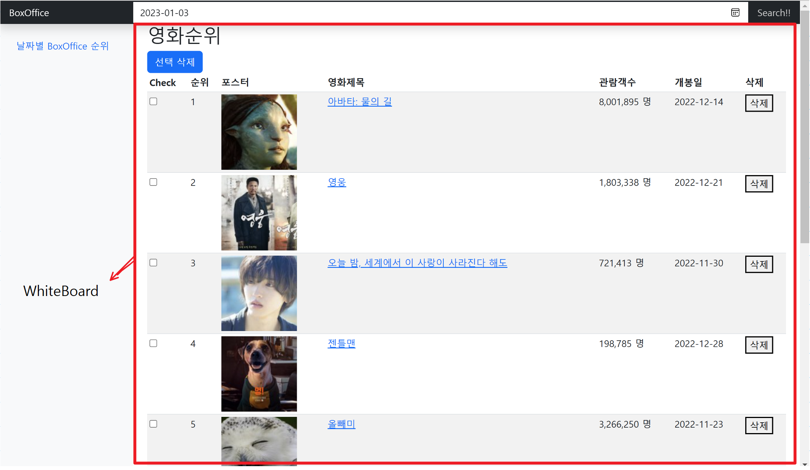
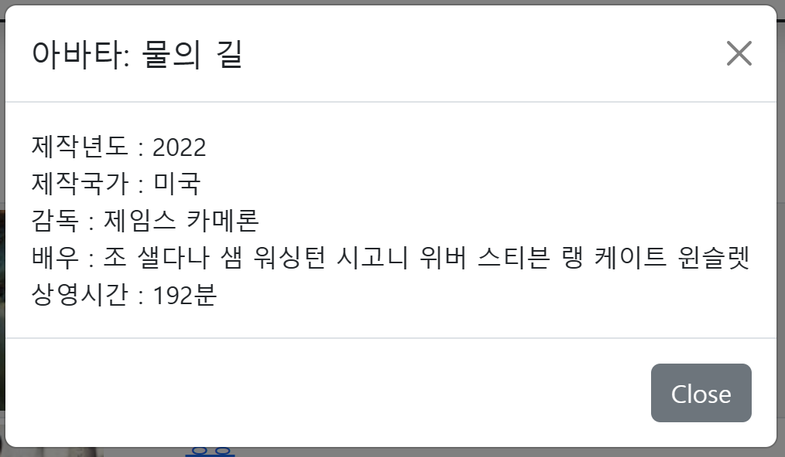
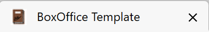

# movie_miniproject
> A Vue.js project
```
v0.1
Javascript + HTML + Vue(Jquery)
영화진흥위원회 일별 박스오피스 API 서비스를 통해 영화검색 구현
카카오 이미지검색 API 서비스를 통해 이미지 검색 및 화면에 띄우기(closer)를 활용해 구현
버튼클릭 후 삭제 또는 각 영화별 검색화면에서 삭제기능 구현
영화 제목 클릭시 영화진흥위원회 영화상세정보 조회 API 서비스를 통해 영화 상세정보 보기 구현 (Modal사용)
```
```
v0.1.1
Jqurey 사용 이후 Vue 사용에 익숙해 지고자 모든 Jquery를 Vue로 변경 완료
```
```
v0.2
Vue CLI를 통해 통합되어 있던 component를 여러 component로 변경 완료
```
mainPage.vue(whiteBoard.vue)   

   
modal.vue   


v0.2.1 favicon 추가   


## Build Setup

``` bash
# install dependencies
npm install

# serve with hot reload at localhost:8080
npm run dev

# build for production with minification
npm run build
```

For detailed explanation on how things work, consult the [docs for vue-loader](http://vuejs.github.io/vue-loader).
